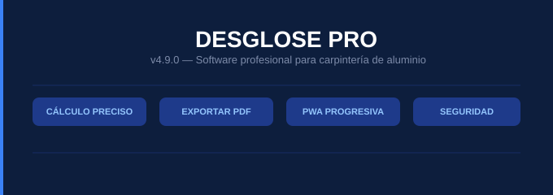

---

## 📋 Descripción

**Desglose Pro** es una Progressive Web App (PWA) diseñada para profesionales de carpintería de aluminio. Permite calcular con precisión los perfiles necesarios para ventanas y puertas, gestionar cotizaciones, controlar gastos y emitir facturas — todo desde cualquier dispositivo, con o sin internet.

---

## 📞 Contacto y Soporte

- **Email:** softwaredesglosepro@gmail.com
- **WhatsApp:** +1 (849) 485-0059
- **Instagram:** [@desglosepro](https://instagram.com/desglosepro)

---

## 📄 Licencia

Copyright © 2026 Desglose-pro. Todos los derechos reservados.

Este software es propietario y confidencial. Su copia, distribución o uso no autorizado está estrictamente prohibido.
